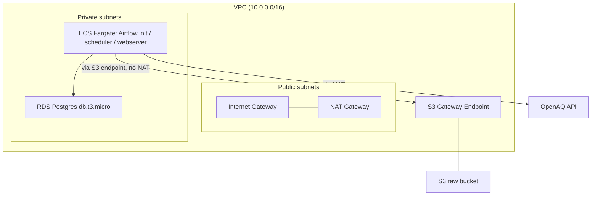
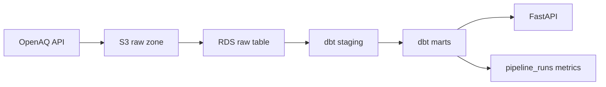

# aq-pipeline

Batch air-quality ETL on AWS: OpenAQ data into S3 and RDS Postgres, transformed
with dbt, orchestrated by Airflow on ECS/Fargate, served by a small FastAPI
layer.


## Architecture

Infrastructure Layout:



Data Flow:



## Stack

| Layer | Choice |
|---|---|
| Ingestion | Python, official `openaq` SDK → S3 raw zone (or local `data/raw`) |
| Orchestration | Airflow, self-hosted on ECS/Fargate (LocalExecutor) |
| Transformation | dbt (staging → marts, with schema tests) |
| Warehouse | RDS Postgres (`db.t3.micro`) |
| Storage | S3 raw landing zone; private subnets reach S3 via a VPC gateway endpoint |
| Infra as code | Terraform (VPC, subnets, security groups, IAM, RDS, ECS, S3, ECR, SSM) |
| CI/CD | GitHub Actions (separate workflows for `/infra` vs `/pipeline` + `/api`) |
| API layer | FastAPI over RDS marts (`/air-quality/{station_id}`, `/pipeline/health`) |
| Secrets | AWS SSM Parameter Store (SecureString), injected into ECS via the `secrets` block |

## Data flow

The `air_quality` DAG runs this chain:

1. **`run_ingestion`**: Pull recent measurements and OpenAQ quality flags for
   configured locations via the official SDK. Write raw JSON to S3 (AWS) or
   `data/raw` (local).
2. **`load_raw_to_postgres`**: Load those JSON objects into
   `raw.openaq_pulls` as JSONB (no flatten at load time).
3. **`dbt_run`**: Build staging (`stg_air_quality`) then marts
   (`mart_station_daily`): daily min/max/avg per station and pollutant,
   with flagged readings kept out of the aggregates.
4. **`dbt_test`**: Schema tests (not-null, accepted values, relationships),
   singular assertions, and source freshness.
5. **Serve**: FastAPI reads from the marts and from `pipeline_runs`
   (station lookup and pipeline health). Not an Airflow task; it sits on
   the warehouse after transforms land.
6. **`log_pipeline_run`**: Write one row to `pipeline_runs` (rows ingested /
   transformed, dbt test counts, duration, `success` or `failed`). Uses
   `trigger_rule=all_done` so failures still get logged.

## Results (live Fargate run)

Captured against real AWS infra (ECS/Fargate → S3 + RDS), not local
docker-compose:

| Metric | Value |
|---|---|
| DAG runs | 4 total; 3 completed successfully end to end |
| dbt tests | 19/19 passed on every successful run |
| Average run duration | ~24 seconds |
| Raw ingest | 9 JSON files (~11.5 MB) across 3 OpenAQ locations |
| RDS | 20 GB allocated (`db.t3.micro` default) |

The 4th run was a deliberate stress test: three DAG runs triggered
concurrently to exercise the failure path. That hit OpenAQ’s free-tier rate
limit. The pipeline caught the SDK error, did not crash, and wrote
`status='failed'` to `pipeline_runs` with the real error message. That was
intentional failure-path validation, not an unexpected outage.

## Local setup

Requires Docker, Python 3.10+, and an [OpenAQ API key](https://explore.openaq.org).

1. Create a `.env` in the repo root (gitignored) with at least:

   ```bash
   DB_HOST=localhost
   DB_PORT=5432
   DB_NAME=aq_pipeline
   DB_USER=aq_user
   DB_PASSWORD=local_dev_only
   OPENAQ_API_KEY=your_key_here
   AIRFLOW__CORE__FERNET_KEY=your_fernet_key_here
   ```

2. Copy the dbt profile example and keep credentials on env vars:

   ```bash
   cp pipeline/dbt/profiles.yml.example pipeline/dbt/profiles.yml
   ```

3. Start Postgres, apply migrations, then bring up Airflow:

   ```bash
   make up
   ```

   This starts Postgres, runs `pipeline/migrations/001_pipeline_runs.sql` and
   creates the separate `airflow` metastore database, then starts the Airflow
   containers. UI: http://localhost:8080 (default login from compose/env).

4. Useful targets:

   | Command | What it does |
   |---|---|
   | `make migrate` | Re-apply warehouse + Airflow DB migrations |
   | `make load-raw` | Load `data/raw` JSON into `raw.openaq_pulls` |
   | `make dbt-debug` | `dbt debug` against local Postgres |
   | `make psql` | `psql` into the warehouse DB |
   | `make down` | Stop compose |

5. Trigger the DAG from the Airflow UI, or:

   ```bash
   docker compose exec airflow-scheduler airflow dags unpause air_quality
   docker compose exec airflow-scheduler airflow dags trigger air_quality
   ```

Leave `S3_BUCKET` unset locally so ingestion writes under `data/raw`. The same
code uses S3 when `S3_BUCKET` is set in the Fargate task environment.

## Deploying to AWS

Infra lives under `infra/` (Terraform). Typical loop:

```bash
cd infra
terraform apply    # VPC, RDS, ECS task defs, S3, ECR, SSM, alarms
# build/push the custom Airflow image to ECR, run airflow-init, then the
# scheduler task and trigger air_quality (see agent notes / runbook for the
# exact ecs run-task and execute-command sequence)
terraform destroy 
```

Secrets (`DB_PASSWORD`, `OPENAQ_API_KEY`, Airflow Fernet key, SQLAlchemy URI)
are SSM SecureString parameters referenced from the ECS task definition
`secrets` block. Non-secrets (`DB_HOST`, `S3_BUCKET`, etc.) stay as plain
environment variables.


## Attribution

Air quality data from [OpenAQ](https://openaq.org). Attribution to OpenAQ,
and to each original data provider under that provider’s own terms, is
required when displaying this data (OpenAQ Terms of Use). This project uses
the OpenAQ v3 API via the official Python SDK for recent measurements and
quality flags.
